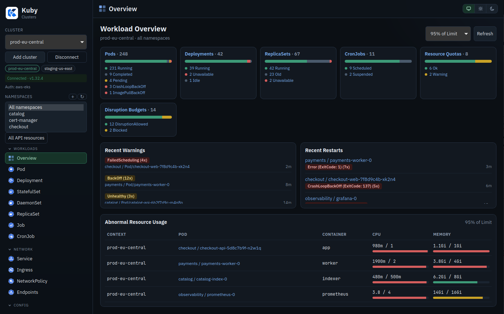

# Kuby

Native multi-cluster Kubernetes desktop client built with **Tauri 2**, **Rust (`kube-rs`)**, and **SolidJS**.



## Features

- Multi-cluster kubeconfig contexts (`KUBECONFIG` honored)
- Live resource watches via `kube_runtime::watcher`
- Generic API discovery + DynamicObject access (incl. CRDs)
- Curated views for ~30 core resource kinds
- Detail / YAML apply / logs / exec / port-forward
- Aggregated logs, global search, multi-namespace selector
- Side-by-side YAML diff + metrics.k8s.io CPU/RAM
- Auth summaries for OIDC/kubelogin, EKS/GKE/AKS exec plugins, client certs, Teleport
- Virtualized lists for large clusters
- Bundling targets: macOS app/dmg, Linux AppImage/deb/rpm + updater plugin

## Develop

Requires **Node 22+**, **pnpm 11**, **Rust stable** (`rust-toolchain.toml`), and a valid `~/.kube/config` (or `KUBECONFIG`). After the platform tooling below:

```bash
pnpm install
pnpm tauri dev
```

### macOS tooling

Xcode Command Line Tools and a rustup-managed toolchain (Homebrew `rust` / system compilers are not enough on their own):

```bash
xcode-select --install
curl --proto '=https' --tlsv1.2 -sSf https://sh.rustup.rs | sh
source "$HOME/.cargo/env"
rustc --version
cargo --version
```

Optional: `brew install gitleaks` for the local Lefthook secret scan.

### Linux tooling (Debian / Ubuntu / Mint)

Do **not** install Cargo via `apt` — that package is too old for Tauri 2. Use rustup:

```bash
curl --proto '=https' --tlsv1.2 -sSf https://sh.rustup.rs | sh
source "$HOME/.cargo/env"
rustc --version
cargo --version
```

Then the WebKitGTK / GTK libraries used by `pnpm tauri dev` and `pnpm tauri build`:

```bash
sudo apt update
sudo apt install -y \
  libwebkit2gtk-4.1-dev \
  libgtk-3-dev \
  libayatana-appindicator3-dev \
  librsvg2-dev \
  patchelf \
  libssl-dev \
  pkg-config \
  build-essential \
  curl wget file \
  libxdo-dev
```

If `pnpm tauri dev` fails with `No such file or directory` on `cargo metadata`, `cargo` is missing from `PATH` — open a new terminal or run `source "$HOME/.cargo/env"`.

## Quality and security

Commit hooks (Lefthook) format staged files and scan for secrets. GitHub Actions run the same checks plus Clippy, tests, cargo-deny, OSV-Scanner, and knip.

```bash
pnpm install          # installs Lefthook hooks
brew install gitleaks # optional local secret scan (CI always runs it)
pnpm quality          # typecheck + Biome + knip
```

Dependabot opens weekly PRs for npm, Cargo, and GitHub Actions.

## Build

```bash
pnpm tauri build

```
## Architecture

```
src-tauri/src/k8s/     ClusterManager, discovery, watch, exec, portforward, metrics, auth
src-tauri/src/commands/ Tauri IPC surface
src/stores/            Normalized Solid store + watch event application
src/components/        YAML (Monaco), logs, xterm exec, virtual list
```
